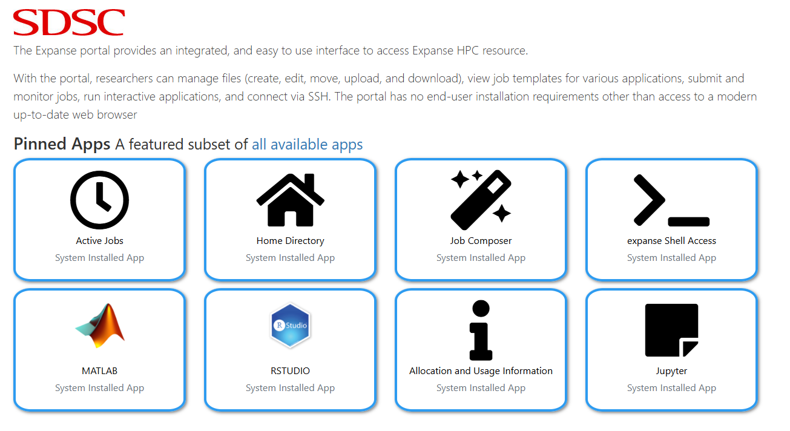

To launch a Jupyter Session via the Expanse portal:

1)  Navigate to https://portal.expanse.sdsc.edu/ in your browser. If you are not yet loggeed in, you will see this:

    

2) Please login by either selecting the option that looks like "your_access_username@access-ci.org" or if that option is not available, "Link an identity". Once you are logged in, you should be redirected to:

    

2) Click "Jupyter". It should be the bottom-right option:

    

3) You should now see a form that looks like this:

    

4) Fill in the following information:

    Account:
        csd973

    Partition:
        shared

    Time limit (min):
        600

    Number of cores:
        32

    Memory required per node (GB):
        64

    GPUs (optional):
        0

    Environment modules to be loaded:
        shared,sdsc/1.0,DefaultModules,slurm/expanse/23.02.7,cpu/0.15.4,intel/19.1.1.217,gsl/2.5,intel-mpi/2019.8.254,fftw/3.3.8,intel-mkl,netcdf-cxx,netcdf-c

    Conda Environment:
        /expanse/projects/qstore/csd973/anaconda3/envs/qdms_tutorial_2

    Reservation:
        QDMS-CPU

    Working Directory:
        /expanse/lustre/projects/csd973/<your user name here>/QDMS_2025

    Type:
        JupyterLab

    *Leave all other boxes blank.*

5) Click "Submit"

    

    After you click submit the page may not immediately respond. *Do not click submit multiple times* as this may result in multiple unneccesary jobs being submitted which can create problems for you and others.

5) You should now be at a screen with a bunch of links that looks like this:

    

    Each link is one Jupyter job. *The bottom link is the most recently launched job*. The links above could be your other notebooks that are still running, or old jobs from hours ago that have exited.

6) Click the *bottom most* link.

    If your job is not yet running, you will see a loading screen that looks like this:

    

8) Please wait until your job is running, at which point you will be redirected to the notebook. Which looks like this:

    