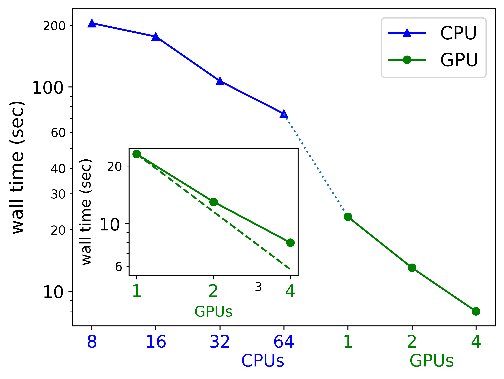
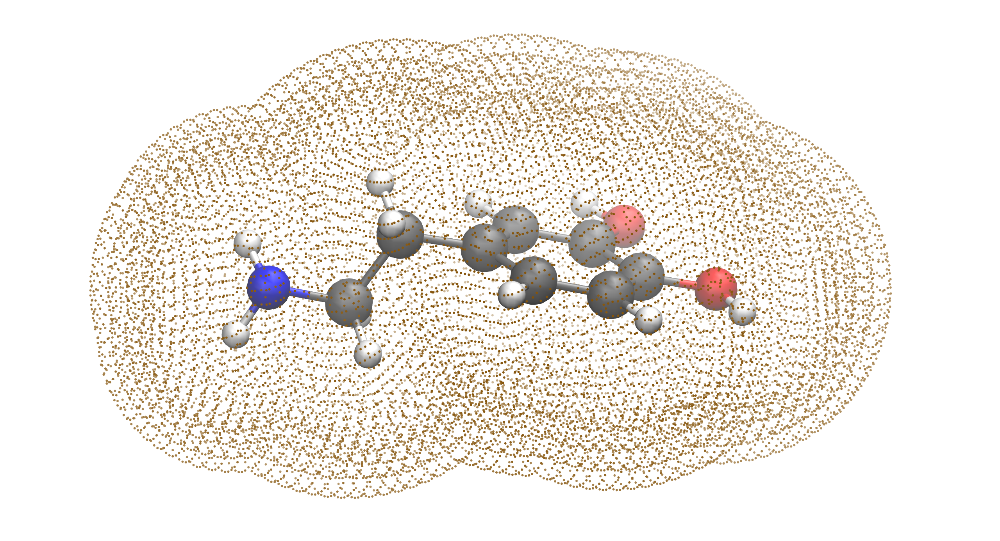

# Hands on tutorial on QUICK
**Date**: July 18, 2025

**Summary**: This session introduces parallel quantum mechanics (QM) and quantum mechanics/molecular mechanics (QM/MM) computing using graphics processing units (GPUs). The use of GPUs is popular across all scientific domains since GPUs can significantly accelerate time to solution for many computational tasks. Recently the use of GPUs for accelerating QM computations is gaining traction. QUICK was the first open-source QM software to harness the power of GPUs. By the end of this session we hope the participants will be able to run high performance computing (HPC) GPU calculations effectively. The session will incorporate hands-on exercises for participants to acquire the basic skills to use GPUs on EXPANSE to perform QM and QM/MM simulations.

**Presented by**: <a href="https://cip-fellows.sdsc.edu/projects/VikrantTripathy/" target="_blank">Vikrant Tripathy</a> (vtripathy@ucsd.edu)

QUICK Github repository: https://github.com/merzlab/QUICK

More information on keywords in QUICK can be found here: https://quick-docs.readthedocs.io/en/latest/

## Accessing GPU nodes and running GPU jobs on SDSC Expanse:

We will log onto an Expanse GPU node, set up our environment and run sample test cases.

1) Log onto EXPANSE
```
ssh <username>@login.expanse.sdsc.edu
```
2) Run two interactive jobs in two shells one each for CPU and GPU
```
srun --account=csd973 --partition=shared --pty --nodes=1 --ntasks-per-node=16 --cpus-per-task=1 --mem=32G -t 3:00:00 --wait=0 --export=ALL --reservation=QDMS-CPU /bin/bash
```
```
srun --account=csd973 --partition=gpu-shared --pty --nodes=1 --ntasks-per-node=1 --cpus-per-task=4 --gpus=1 --mem=20G -t 2:00:00 --wait=0 --export=ALL --reservation=QDMS-GPU /bin/bash
```
3) Let us start with the shell running on GPU node. Once we are on a GPU node, we load the required modules to gain access to the GPU software stack.
```
source /expanse/projects/qstore/csd973/quick.sh
```
Source a file means run commands in the file as if you are typing on the command line. This is a safe way to load the modules for different softwares/projects and reproduce the module environment in the future (given the modules are still available). Please view the modules you are loading.
```
cat /expanse/projects/qstore/csd973/quick.sh
```
`cuda11.7/toolkit/11.7.1` provides the CUDA Toolkit. Check if you have cuda toolkit available.
```
nvcc --version
```
You should see following output
```
nvcc: NVIDIA (R) Cuda compiler driver
Copyright (c) 2005-2022 NVIDIA Corporation
Built on Wed_Jun__8_16:49:14_PDT_2022
Cuda compilation tools, release 11.7, V11.7.99
Build cuda_11.7.r11.7/compiler.31442593_0
```
We can use the `nvidia-smi` command to check for available GPUs and which processes are running on the GPU.
```
nvidia-smi
```
You should have a single V100 GPU available and there should be no processes running:
```
Sun Jul 13 18:36:29 2025       
+-----------------------------------------------------------------------------+
| NVIDIA-SMI 525.85.12    Driver Version: 525.85.12    CUDA Version: 12.0     |
|-------------------------------+----------------------+----------------------+
| GPU  Name        Persistence-M| Bus-Id        Disp.A | Volatile Uncorr. ECC |
| Fan  Temp  Perf  Pwr:Usage/Cap|         Memory-Usage | GPU-Util  Compute M. |
|                               |                      |               MIG M. |
|===============================+======================+======================|
|   0  Tesla V100-SXM2...  On   | 00000000:18:00.0 Off |                    0 |
| N/A   37C    P0    42W / 300W |      0MiB / 32768MiB |      0%      Default |
|                               |                      |                  N/A |
+-------------------------------+----------------------+----------------------+
                                                                               
+-----------------------------------------------------------------------------+
| Processes:                                                                  |
|  GPU   GI   CI        PID   Type   Process name                  GPU Memory |
|        ID   ID                                                   Usage      |
|=============================================================================|
|  No running processes found                                                 |
+-----------------------------------------------------------------------------+
```
## QM calculations on QUICK
All input files are in the `/expanse/projects/qstore/csd973/tutorials/5_GPU_Comp_using_QUICK/` directory. We recommend to copy the directory to the scratch directory on the compute node for faster IO.
```
cd $SLURM_TMPDIR
cp -r  /expanse/projects/qstore/csd973/tutorials/5_GPU_Comp_using_QUICK/ .
cd 5_GPU_Comp_using_QUICK/QM_calc/
```
Make sure QUICK and Amber are in your PATH.
```
source /expanse/projects/qstore/csd973/ambertools25_src/install_gpu/amber.sh
source /expanse/projects/qstore/csd973/QUICK/install/quick.rc
```
Run the following commands to ascertain you have the required executables.
```
which quick
which quick.MPI
which quick.cuda
which sander
which sander.quick.cuda
```
### Single point calculation
Let us consider taxol as our test case.


First,let us run a single point energy calculation. This means, given the coordinate what is the total energy (sum of electronic and nuclear energy).

Fun fact, **Nuclear energy is probably the easiest way to ascertain if two conformations are identical**

Go to the QM_calc directory and run QM calculation on Taxol using a small basis set (6-31G).
```
quick.cuda taxol_small_basis_set_1gpu.in
```
Open the output and check the result.
```
vi taxol_small_basis_set_1gpu.out
```
Now run CPU jobs for comparison.

Go to the shell running interactive job on CPU node. **Do not close the shell running job in GPU node**

Do the environment setup analogous to the GPU node.
```
cd $SLURM_TMPDIR
cp -r /expanse/projects/qstore/csd973/tutorials/5_GPU_Comp_using_QUICK/ ./
cd 5_GPU_Comp_using_QUICK/QM_calc/
source /expanse/projects/qstore/csd973/quick.sh
source /expanse/projects/qstore/csd973/ambertools25_src/install/amber.sh
source /expanse/projects/qstore/csd973/QUICK/install/quick.rc
```
Run `lscpu` to get details of the EXPANSE compute node CPU architecture.
Launch 16 MPI processes with QUICK on AMD EPYC 7742 CPUs.
```
mpirun -np 16 quick.MPI taxol_small_basis_set_16cpu.in
```
View the result of the computations.
```
vi taxol_small_basis_set_16cpu.out
```
The calculations on GPU are significantly faster than the calculaions on CPU.


Please close the shell running the CPU job and go back to the shell running interactive job in GPU node. 
The last example used a small basis set. However, for production level calculations you may need a larger basis set including diffuse functions. We will not have time to run the large basis set calculation. The large basis set (6-311++G(2d,2p)), including diffuse functions, calculation can be run by running the following code:
```
# skip this
cd $SLURM_TMPDIR/5_GPU_Comp_using_QUICK/QM_calc/
quick.cuda taxol_large_basis_set.in
```
The above calculation will not converge!! This is due to the presence of large number of diffuse basis functions which leads to linearly dependent basis functions (small eigen value of the overlap matrix). This is a general issue with QM codes and not specific to QUICK.

Tightening numerical cutoff values facilitates convergence. The following calculation will converge.
```
# skip this
quick.cuda taxol_large_basis_set_tightcut.in
```
Thus, generally if you have convergence issues it arises from either loose cutoff criteria or bad coordinates. You have to be careful to avoid providing coordinates in atomic units.

### Geometry optimization
"Shajan, A.; Manathunga, M.; Götz, A.W.; Merz, K.M. Geometry optimization: A comparison of different open-source geometry optimizers. J. Chem. Theory Comput. 19, 7533-7541 (2023)."

Molecular properties at high energy structures can be very different compared to the molecular structures accessible at room temperatures. Thus, low energy structures are required for comparison to experiments. Geometry optimization is necessary to obtain low energy structures. To perform geometry optimization in QUICK run the following command:
```
cd $SLURM_TMPDIR/5_GPU_Comp_using_QUICK/QM_calc/
quick.cuda dopamine_opt_dlfind.in
```
The above example uses the DL-Find optimizer with redundant internal coordinates.

"Kästner, J.; Carr, J. M.; Keal, T. W.; Thiel, W.; Wander, A.; Sherwood, P. DL-FIND: An Open-Source Geometry Optimizer for Atomistic Simulations. J. Phys. Chem. A 113, 11856-11865 (2009)."

You can also use the legacy QUICK optimizer. However, this is **not recommended** as it uses a Cartesian coordinate system with a unit matrix as the initial Hessian and needs more steps for convergence.
```
# Will take more iterations
quick.cuda dopamine_opt_lopt.in
```
### Properties: ESP and RESP charge computation
One of the primary properties you can compute in QUICK. This will be documented in the next release of QUICK. 

You can compute ESP charges by running the following:
```
quick.cuda dopamine_esp.in
```
This will generate an output (`dopamine_esp.out`) and a file (`dopamine_esp.vdw`) containing the grid points used to obtain the ESP charges and the corresponding electrostatic potentials.



To compute RESP you need to use antechamber package in Ambertools.
```
antechamber -i dopamine_esp.out -fi quick -o dopamine_esp.mol2 -fo mol2 -c resp -s 2 -pf y
rm qout QOUT punch esout  # Remove intermediate files
```
`dopamine_esp.mol2` contains the RESP charges.
## QM/MM calculation using QUICK and AMBER
**The basis sets are small here compared to the published results**
### Simulation setup

Calcium(2+) ion coordinating to the carboxylate group of acetyl- and 
N-methyl-capped aspartate, solvated in a droplet of water, as
model system for ion/protein interactions in aqueous solution.

Model taken from

An extensible interface for QM/MM molecular dynamics simulations with AMBER.
A. W. Götz, M. A. Clark, R. C. Walker,
J. Comput. Chem. 35, 95-108 (2014). DOI: 10.1002/jcc.23444

### Simple constant temperature molecular dynamics

Both MM and QM/MM simulations are performed at constant temperature
with Langevin dynamics to control temperature. A time step of 1.0 fs
is employed, which is at the upper limit for simulations that do not 
constrain distances to hydrogen atoms via e.g. the SHAKE algorithm.

Short molecular dynamics is performed.

More advanced algorithms could probe the potential of mean force for 
the dissociation of Ca(2+) from aspartate. This could be achieved for 
example via umbrella sampling simulations, as has been done in the 
publication cited above.

### MM simulation in subdirectory mm

The Ca(2+) ion and acetyl- and N-methyl-capped aspartate are 
represented by the Amber ff99SB force field.

The water molecules use the SPC/Fw flexible water model.

The example runs for 1000 steps (1 ps).

Run the MM MD simulation:
```
cd $SLURM_TMPDIR/5_GPU_Comp_using_QUICK/MM
# Run in serial on CPU 
sander -O   # -O forces overwriting of existing output files
# Run in parallel on CPU 
mpirun -np 16 sander.MPI -O
#Rename the prmtop file as inp.prmtop and mdcrd file as mdcrd.nc
mv prmtop inp.prmtop
mv mdcrd mdcrd.nc
```
Go to `https://molstar.org/viewer/` and upload `inp.prmtop` and `mdcrd.nc` files to the Model and Coordinates under Load Trajectory.
You should be able to visualize the trajectory.

Or inspect the output file mdout and visualize the MD trajectory with vmd 
```
vmd -parm7 prmtop -netcdf mdcrd
```

### QM/MM simulation

All solute and ion atoms are in the QM region.
All water molecules are in the MM region.

The example runs for 20 steps (20 fs) 

Run the QM/MM MD simulation with the sander/QUICK executable:
```
cd $SLURM_TMPDIR/5_GPU_Comp_using_QUICK/QMMM
# Run in serial on CPU (will take too long)
sander -O  
# Run in parallel on CPU (will take too long)
mpirun -np 16 sander.MPI -O  
# Run on single GPU 
sander.quick.cuda -O  
```

### QM/MM simulation of photoactive yellow protein (PYP)

QM/MM periodic boundary condition simulation using three different
QM regions (R1, R2 and R4 has 22, 49 and 159 atoms respectively).
R1 contains only the chromophore in the QM region. R2 and R4 contains
2 and 11 residues around the chromophore respectively.

Model taken from

Quantum Mechanics/Molecular Mechanics Simulations on NVIDIA and AMD Graphics Processing Units
M. Manathunga, H. M. Aktulga, A. W. Goetz, K. M. Merz, Jr.
J. Chem. Inf. Model. 2023,  63, 711-717

QM/MM simulations are perfomed 0.5 fs timestep with periodic boundary condition.
The larger QM systems are more accurate but, computationally expensive.

Run the QM/MM MD simulation with the sander/QUICK executable:
```
cd $SLURM_TMPDIR/5_GPU_Comp_using_QUICK/QMMM_pyp/R1
# Run in serial on CPU (will take too long)
sander -O
# Run in parallel on CPU (will take too long)
mpirun -np 16 sander.MPI -O
# Run on single GPU
sander.quick.cuda -O
```

